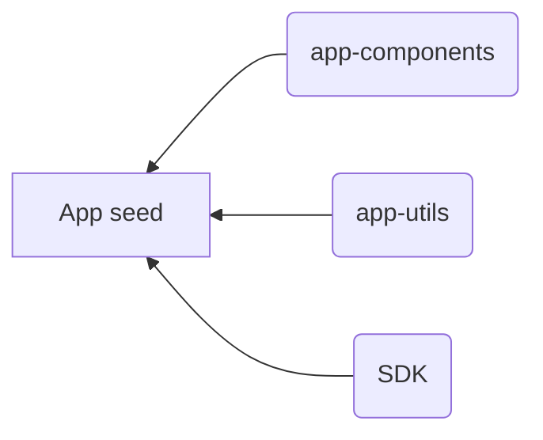

# Datorama React app components

## Installation

    npm install --save git+ssh://git@github.com/datorama/app-components.git

Set up global theme

    import { AppTheme, lightTheme } from 'app-components';
    import { ThemeProvider } from 'styled-components';
    
    const App = () => (
	    <AppTheme theme={lightTheme} provider={ThemeProvider}>
		    ...
	    </AppTheme>
    );

